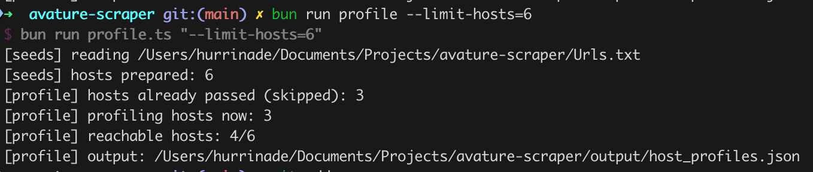
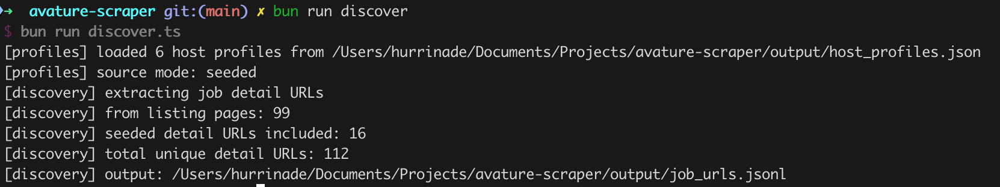
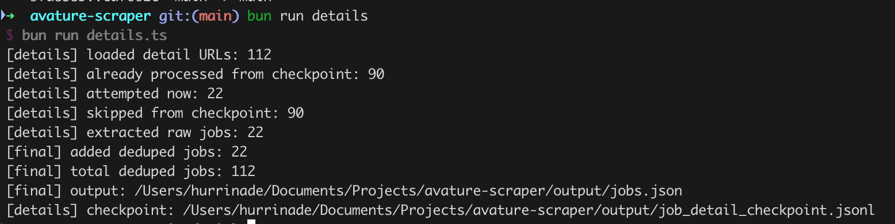

# PROCESS

High level overview on how my implementation works

- process is in steps and can be upgraded

```
1. Seeding
2. Profiling
3. More urls discovery and job details urls retrieval
4. Job details extraction and file storing
```

Small research of potential endpoints [here](./research.md)

More in depth file of func [here](./docs/pipeline-steps.md)

# Seeding

From Urls.txt file get all hosts and urls connected to them, it would be okay if certain stuff gets filtered like, endpoints that have /Login, or /Error, are not needed, this is just connected to entrypoint url cleanup

Some of mandatory url paths:

/careers\
/careers/JobDetail - for unique jobs and their details\
/careers/SearchJobs/ - for job filtering\
...

- seeding and profiling is checking if host is reachable, and also then if urls are reachable, all this is done in concurency as it is a huge file
- urls are also deduped in case there is same ones

# Profiling

After gathering all seeds for certain host, there should be profiling section, here the urls should tested if they are even reachable and if not they should be rejected and removed. Also some common patterns should be established here so that more urls can be tested after exiting ones are tested

- here is also checkpointing system which checks if hosts were already extracted so it skips them
- marks hosts unreachable if all its urls from initial input file are unreachable
- urls are separated per pagniation search requests and job filtering (job search urls), and requests that are focused on one unique job (job details urls)



- image and output shows, amount of hosts retrieved and how many of them are reachable, reachability is tested with simple tcp connection

# Discovery

After profiling we should have clear urls which were not rejected and they returend something. Now all those urls should be executed and stuff should be extracted. From research, urls return htmls as it is all ssr-d and I cannot send any api request to make it simpler.

Also I am extending urls covereage with custom query params which I observed during research phase. Some notes on that:

- https://bloomberg.avature.net/careers/SearchJobs/?1845=%5B162634%5D&1845_format=3996&listFilterMode=1&jobRecordsPerPage=12&
- istFilterMode, jobRecordsPerPage don't seem to do anything even tho they should be doing filterings
- jobOffset in the other hand does stuff and is used for pagination, that param is used then to find more jobs and retrieve their urls for later details retrieval, offest iteratest through pages and on each page I gather job listings.

This is also a discovery level where I create new urls with certain query params so that I can get to all jobs. In this case I retrieve amount of results per careers page together with current position and then I change offset which basically iterates through the pages. And on each page I gather job listing.



- here we can see how many job urls were extracted from job search listings + already given urls in urls.txt file

# Job extraction (details)

When gathered all JobDetails urls (or any similar) then all of those should be exectued to retrieve then job details for final data, also there can probably be urls with JobDetail already seeded from beggining and those urls should also be tested if they return anything, and now again fetched to see if they return relevant job details.

Data is retrieved from html as jobs have recognizable html structure which can be easily parsed.

- added checkpoint so if extraction fails we can continue from left of point
- finally all that data is stored to a file in this case `jobs.json`



- this is now how many jobs were extraxted and how many already skipped because of checkpointing system

## What to improve:

- better checkpointing
- filtering urls which are used (clearing of whole Urls file) (overall cleanup of the file)
- final data cleanup so all metadata is same per each job currently it is with different keys as many sites have different labels for their job metadata
- Initial discovery of more urls and hosts which can be scraped, this gets stored to some file for future scraper to use, I have hit some bot detection limitation so I did not go deeper into avoiding those as I don't think it is in scope of the assesment

## Relevant files

- `host_profiles.json` - file with all hosts and their seeded reachable urls which are separated based on jobDetail urls and job list urls (searchJobs)
- `job_urls.jsonl` is file with list of jobDetail urls gathered from job listings or the ones already there from initial Urls.txt file
- `job_detail_checkpoint.jsonl` is a file which is used to track which job urls were already extracted
- `jobs.json` - file with all jobs extracted data
